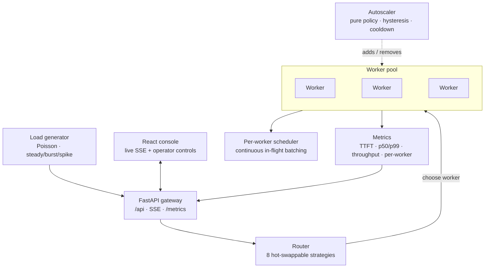
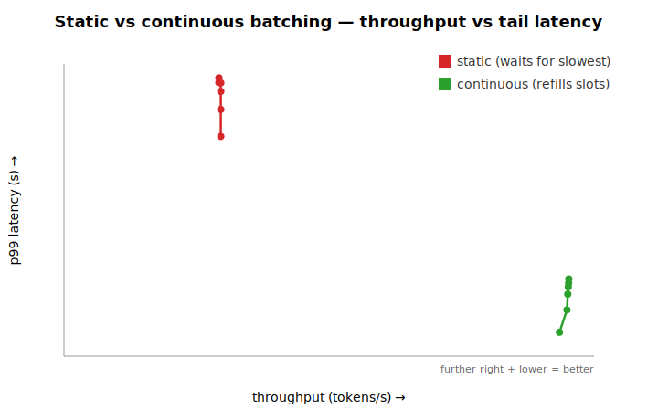
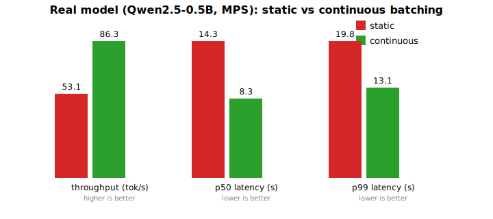

# LLM Inference Control Plane

A small but real LLM inference serving system: a **control plane** — intelligent router,
autoscaler, and a live observability console — sitting on top of model workers that do
**continuous (in-flight) batching**. It is built to demonstrate distributed-systems
competence for inference serving: the depth is in the routing + scheduling + autoscaling +
observability spine, and every decision is backed by before/after measurement.

- **Live demo:** https://llm-dashboard.nilu.app *(sim backend, gated + capped)*
- **The money result:** continuous batching beats static **3.2× on throughput** in simulation and
  **1.62× on a real model** (Qwen2.5-0.5B on Apple MPS), with markedly lower tail latency — see
  [Findings](#findings-static-vs-continuous-batching).

---

## The problem

Serving one LLM to many users is slow because requests queue behind each other and a single model
handles them one at a time. Production systems fix this with two ideas working together:

1. **Batching** — run many requests through the model in one forward pass, amortizing the
   expensive weight-load over the whole batch. The non-trivial version is *continuous* (a.k.a.
   in-flight / iteration-level) batching: admit and evict sequences *every decode step* instead of
   waiting for a whole batch to finish.
2. **Multiple replicas + intelligent routing + autoscaling** — spread load across workers, send
   each request to the right one, and match capacity to demand.

**Thesis this project optimizes for:** *given a fixed pool of workers and a mixed workload,
intelligently route, schedule, and autoscale to maximize useful throughput while protecting
interactive tail latency — and prove every decision with observability.* The **control plane is
the centre of gravity**, not the batching kernel.

## What this is

A toy-scale but honest implementation of that control plane. Its defining design choice is a
single **swappable `Worker` backend** behind one interface, so everything above the worker —
router, scheduler, autoscaler, metrics, UI — is backend-agnostic and deterministically testable.

| Backend | What it is | What it demonstrates |
| --- | --- | --- |
| **SimWorker** | No real model; tunable latency/throughput profile + a modelled prefix-cache speedup. Runs anywhere, can fake hundreds of workers. | The control plane, deterministically (powers the tests, the portable demo, and the benchmark). |
| **OpenAIWorker** | Points at any OpenAI-compatible endpoint (Ollama / vLLM / LM Studio). | Routing / autoscaling / observability against a real model — but the *external* server owns batching, not us. |
| **RealModelWorker** | A real small model (Qwen2.5-0.5B) where **we own the decode loop**: KV cache, batched forward passes, admit/evict every step. | **Our** continuous batching, on real hardware. |

This one abstraction is simultaneously the demo-portability story, the hardware-agnostic story
(mirroring how real fleets put diverse accelerators behind one interface), and what makes the
whole control plane unit-testable against the sim.

## Architecture



Two seams keep the whole thing decoupled and testable — both are **pure** (state in → decision
out, no model, no network, no I/O):

```python
class Worker(Protocol):
    def admit(self, req: Request) -> SeqId: ...
    def step(self) -> list[TokenEvent]: ...   # advance the running batch one decode step
    def in_flight(self) -> int: ...

class RoutingStrategy(Protocol):
    def choose(self, states: list[WorkerState], req: Request) -> WorkerId: ...
```

## What's built

- **Continuous-batching scheduler** (`scheduler.py`) — a pure advance → evict → admit engine.
  `ContinuousScheduler` refills freed slots every step (à la Orca); `StaticScheduler`, the demo
  villain, makes the whole batch wait for the slowest sequence. Property-tested with `hypothesis`
  (never over-admits, no starvation, per-sequence accounting never mixes).
- **Router + 8 routing strategies** (`routing/`) — naive baselines (`random`, `round-robin`) that
  make the smart ones legible, load-aware strategies (`least-queue-depth`, `least-pending-tokens`,
  `power-of-two-choices`), and inference-native ones (`prefix-affinity`, `priority/SLA`,
  `hardware-aware`). Switchable live; the router filters unhealthy workers.
- **Autoscaler** (`autoscaler.py`) — a pure `decide(snapshot) → ScaleAction` policy with a
  hysteresis band and a cooldown so it can't flap. Respects min/max bounds.
- **Observability** (`metrics.py`) — per-request lifecycle → staged timings (TTFT, end-to-end),
  throughput, and p50/p99 over a rolling window, plus a Prometheus `/metrics` exposition.
- **Load generator** (`loadgen.py`) — Poisson arrivals via thinning with steady / burst / spike
  presets; a pure seedable planner for benchmarks and a live generator for the gateway.
- **Runtime** (`pool.py`, `gateway/app.py`) — a `PoolManager` that ties workers + router +
  autoscaler + metrics into a steppable loop (backend-agnostic via a worker factory), exposed by a
  FastAPI gateway: submit, live strategy switch, autoscaler config, load-gen control, kill-worker,
  an SSE stream, and `/metrics`.
- **React control console** (`ui/`) — metric cards, a live throughput chart, the worker-pool view,
  the strategy switcher, autoscaler panel, load-gen controls, a recent-requests log with
  per-request routing decisions, and one-click scenario buttons — all driven by the SSE stream.
- **Real backends** (`workers/`) — `OpenAIWorker` (streaming, mock-tested in CI) and
  `RealModelWorker` (transformers + MPS) with **true incremental continuous batching**: running
  sequences only ever decode against a persistent KV cache, and admitting a sequence prefills *it
  alone* and splices its cache into the running batch (no re-prefill).
- **Deploy** — a one-command Docker Compose stack (`make up`), plus a co-host overlay that runs the
  demo behind an existing reverse proxy, with sim-only / capped / token-gated guardrails.

## Routing strategies

The contrast *is* the demo: under one bursty, skewed load you can step from a naive baseline to an
inference-native strategy and watch p99 and cache-hit-rate move on the dashboard.

| Strategy | Rule | Why it matters |
| --- | --- | --- |
| `random` | pick any worker | the floor |
| `round-robin` | cycle in order, ignore load | breaks under skew (LLM output length varies ~10×) — the headline villain |
| `least-queue-depth` | fewest outstanding requests | big jump over round-robin |
| `least-pending-tokens` | fewest estimated remaining *tokens* | LLM-aware: a 2000-token request ≠ a 10-token one |
| `power-of-two-choices` | sample 2, route to the lighter | near-optimal at O(1); avoids global-least-loaded thundering herd |
| `prefix-affinity` | route a shared prompt prefix to the worker holding its cached KV | proves serving is stateful; ties to prompt caching (cf. GORGO) |
| `priority / SLA` | interactive jumps onto the least-loaded; batch backfills the busiest | maps to prod / batch workloads |
| `hardware-aware` | latency-sensitive → fast workers; throughput → slow ones | the compute-agnostic story without real heterogeneous hardware |

## Findings: static vs continuous batching

`make bench` drives an identical skewed workload (≈10× output-length spread) through one worker
under each scheduling policy and emits a throughput-vs-tail-latency graph. This is the project's
core measurement.

### In simulation



| metric | static | continuous |
| --- | --- | --- |
| peak throughput | 224 tok/s | **722 tok/s (3.2×)** |
| p99 latency (light load) | 72.4 s | **7.9 s** |
| makespan | 96.1 s | **30.4 s** |

A `test_bench` assertion fails CI if this ever flips. These are **deterministic-sim** numbers —
the sim's job is to prove the *structural* win (slot reuse vs whole-batch-wait), independent of any
particular hardware.

### On a real model (`make bench-real`, Qwen2.5-0.5B, Apple MPS)



| metric | static | continuous |
| --- | --- | --- |
| throughput | 53 tok/s | **86 tok/s (1.62×)** |
| p99 latency | 19.8 s | **13.1 s (1.51× lower)** |

The structural win holds on real hardware. Two findings worth calling out:

- **The margin is smaller than the sim (1.62× vs 3.2×)** — real prefill and decode have costs the
  sim abstracts away, so slot-reuse buys proportionally less. Re-running on a real model to surface
  exactly this is the point of keeping the sim honest.
- **A naive continuous batcher would have *lost*.** Our first implementation rebuilt the KV cache
  on every admission (re-prefilling all running sequences); under churn that recompute erases the
  benefit. Winning required *true* incremental batching — prefill the newcomer alone and splice its
  cache into the running batch — verified on-device to match HuggingFace `generate()` token-for-token
  and to keep batched sequences isolated (no cross-attention leakage).

## The control console

Not a read-only dashboard — a console a reviewer **operates**:

- **Load generator** — steady / burst / spike presets, adjustable rate, start/stop.
- **Routing** — switch strategy live and watch the worker-pool view and p99 react.
- **Autoscaler** — toggle it, set min/max + target queue depth, watch it add workers under
  pressure and reclaim them when idle.
- **Worker-pool view** — per-worker queue depth + in-flight + load bar (where the load goes).
- **Observability** — throughput, TTFT p50/p99, in-flight, and a recent-requests log with each
  request's routing decision and timings.
- **Scenario buttons** — one-click "kill a worker" / "traffic spike" for clean before/after moments.

## Running it

```bash
make setup        # uv sync --extra dev (Python 3.12, managed by uv)
make test         # pytest — scheduler property tests, routing, autoscaler, metrics, API contracts
make lint         # ruff check + format --check
make typecheck    # mypy (strict on src/)
make bench        # produce the static-vs-continuous money graph
```

**Run the live control plane** (two terminals — the UI proxies `/api` to the gateway):

```bash
make dev          # backend gateway on http://127.0.0.1:8000
make ui-install   # first time only
make ui-dev       # console on http://localhost:5273
```

### Ways to run it

Pick by what you want to show. "Our batching?" is the key column — our continuous
batching only runs when *we* own the decode loop (sim or the host-native real model);
anything backed by an external server (Ollama/vLLM) exercises the control plane but not
our batcher.

| # | Mode | Command | Dockerized? | Real model? | Our batching? |
|---|------|---------|:-----------:|:-----------:|:-------------:|
| 1 | **Hosted demo** | open the live URL above | n/a | ❌ sim | ✅ |
| 2 | **Docker (sim)** | `make up` → `localhost:8080` | ✅ everything | ❌ sim | ✅ |
| 3 | **Docker + real model (Ollama hybrid)** | `make up-ollama` → `localhost:8080` | ✅ control plane | ✅ | ❌ (Ollama's) |
| 4 | **Local dev, bring-your-own model** | `WORKER_BACKEND=openai OPENAI_BASE_URL=… MODEL_NAME=… make dev` | ❌ host-native | ✅ | ❌ (server's) |
| 5 | **Full real model (our batcher)** | `uv sync --extra realmodel` → `WORKER_BACKEND=realmodel make dev` | ❌ host-native | ✅ | ✅ **ours** |

**1 — Hosted demo.** Sim backend on the VPS; click and operate. Zero setup, but sim-only
(see Honesty constraints).

**2 — Docker (sim).** `make up` builds the whole stack (control plane + console) and serves
it at `http://localhost:8080`. Any OS, zero deps, no model. The portable way to drive the
routing / autoscaling / observability spine.

**3 — Docker + real model (Ollama hybrid).** The control plane runs in Docker, but the model
runs **natively on the host** via Ollama — because Docker on macOS has **no GPU passthrough**,
so a model inside a container would be CPU-only. The dockerized control plane reaches host
Ollama over `host.docker.internal`. This mirrors production (the model server is always a
separate process from the control plane). Setup:

```bash
ollama serve            # in one terminal (or the Ollama app)
ollama pull qwen2.5:0.5b
make up-ollama          # control plane in Docker → real local model; console at :8080
# override the model with: MODEL_NAME=llama3.2:3b make up-ollama
```

Shows real routing/observability against a real model; **Ollama owns the decode loop, so this
is not our batching.**

**4 — Local dev, bring-your-own model.** Same idea as 3 but fully host-native (no Docker) and
points at any OpenAI-compatible server you run (Ollama / vLLM / LM Studio):
`WORKER_BACKEND=openai OPENAI_BASE_URL=http://localhost:11434 MODEL_NAME=qwen2.5:0.5b make dev`.

**5 — Full real model, our batcher.** The headline mode: a real model (default
`Qwen2.5-0.5B-Instruct`) running **our** continuous batching on Apple MPS. Host-native only.
`uv sync --extra realmodel`, then `WORKER_BACKEND=realmodel make dev`, or `make bench-real` for
the static-vs-continuous benchmark. Downloads the model (~1 GB) on first run.

> **Why no single "real model in one container"?** Docker Desktop on macOS runs containers in a
> Linux VM with no access to Apple's GPU (Metal/MPS), so a containerized model is CPU-only and
> `torch`'s MPS device isn't even available. Hence modes 3–4 keep the model on the host. On Linux
> with an NVIDIA GPU + the container toolkit you *can* give a container the GPU and collapse this
> into one stack.

## How it's engineered

- **Test-driven throughout.** The pure logic — scheduler, every routing strategy, the autoscaler —
  is written tests-first and covered exhaustively (incl. `hypothesis` property tests) against
  fabricated states. Slow/flaky model code stays thin behind the `Worker` interface.
- **Strict seams, small modules.** `Worker` and `RoutingStrategy` are never bypassed; policy is
  pure and I/O lives only in the worker and the gateway loop.
- **Quality gates.** `ruff` (lint + format) and `mypy --strict` on `src/`, enforced in CI across a
  Python job and a UI (Vitest + `tsc` build) job. The heavy ML deps are an optional extra and never
  touch CI; on-device tests are gated behind a marker.

## Honesty constraints

- Our batching is **continuous (in-flight) batching, non-paged** — we do *not* implement
  PagedAttention. The KV cache is contiguous + left-padded.
- The hosted/sim and OpenAI-backend modes prove **routing / autoscaling / observability, not our
  batching**. Our batching is shown only in real-model mode + the benchmark.
- The benchmark's absolute numbers are model-defined; they demonstrate the structural win, not a
  hardware claim.
- The public demo is **sim-only**, with hard caps (workers / rate / token counts), token-gated
  controls, resource limits, and `/metrics` never exposed. Custom OpenAI endpoints are a
  local/self-hosted feature only (taking an arbitrary URL server-side is SSRF; a hosted box also
  can't reach a reviewer's localhost model).

## What we'd do next

Concrete, in roughly the order they'd pay off:

- **PagedAttention-style KV management.** Our contiguous + left-padded cache wastes memory and caps
  batch size; paging would remove fragmentation and let batches grow — the single biggest lever.
- **Chunked prefill.** Our prefill/decode-step split stalls decode during a prefill; chunking
  prefill interleaves them and smooths tail latency.
- **Prefill/decode disaggregation + disaggregation-aware routing** (DistServe / Splitwise) — run
  prefill and decode on separate pools and route accordingly.
- **Speculative decoding** — a latency axis that stacks on top of batching.
- **Output-length prediction** — better `least-pending-tokens` routing and scheduling once you can
  estimate remaining work per request.
- **Smarter autoscaling** — predictive / cost-aware scaling instead of threshold + cooldown.
- **Cross-node / cross-region routing** — KV-cache-reuse-aware placement at fleet scale (GORGO).
- **Persisted observability** — ship `/metrics` to Prometheus + Grafana and add per-stage tracing.

## Background / prior work

- **Orca** — iteration-level scheduling (continuous batching) + selective batching. Yu et al.,
  OSDI 2022. The idea this project implements at toy scale (≈36.9× throughput vs prior systems,
  serving-infra only, no model changes).
- **vLLM / PagedAttention** — KV-cache memory management that makes continuous batching
  memory-efficient. Kwon et al., SOSP 2023.
- **GORGO** — KV-cache-reuse-aware cross-region routing; reference for prefix-affinity routing.
- **Frontier (for awareness):** prefill/decode disaggregation (DistServe, Splitwise), chunked
  prefill, speculative decoding.

## Repository layout

```
src/inference_demo/
  types.py            shared contracts (Request, TokenEvent, WorkerState, …)
  scheduler.py        continuous + static batching (pure)
  routing/            RoutingStrategy protocol, the 8 strategies, the Router
  autoscaler.py       pure scaling policy
  metrics.py          staged timings + Prometheus
  loadgen.py          Poisson load generator + presets
  pool.py             PoolManager (ties it together, backend-agnostic)
  gateway/app.py      FastAPI: API, SSE, /metrics, demo guardrails
  workers/            Worker protocol, SimWorker, OpenAIWorker, RealModelWorker
  bench/              static-vs-continuous benchmarks (sim + real model)
ui/                   React + TypeScript control console (Vite)
deploy/               Dockerfiles, Caddyfile, prod/co-host compose overlays
docker-compose.yml    sim stack (control plane + console) — `make up`
docker-compose.ollama.yml  override: control plane → host-native Ollama — `make up-ollama`
```
